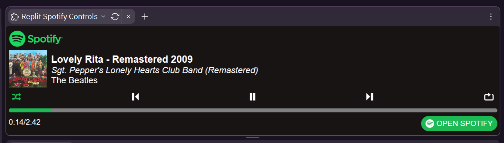
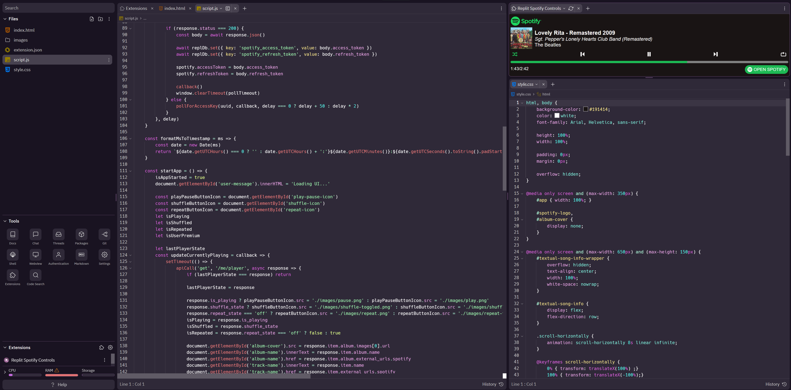
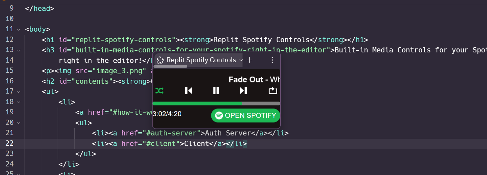

**Replit Spotify Controls**
===========================

### Built-in Media Controls for your Spotify, right in the editor!

**Contents**
------------

*   [How it Works](#how-it-works)
    *   [Auth Server](#auth-server)
    *   [Client](#client)
*   [Setup](#setup-your-own-server-and-client)
    *   [Server Setup](#server-setup)
    *   [Spotify Developer Dashboard Setup](#spotify-developer-dashboard-setup)
    *   [Client Setup](#client-setup)
*   [Screenshots](#screenshots)

**How it Works**
================

The extension is made up of two parts, the extension itself, and an authorization server in another repl. These both communicate together to create a secure connection with the Spotify API. Lets start with the server.

**Auth Server**
---------------

The auth server handles authorization with Spotify Oauth and is responsible for retrieving spotify **access tokens** for the client. In order the Spotify API, each user needs their own personal access token which is linked to their account specifically. This is not to be confused with the **client secret**. The client secret is the token used to allow the server access to Spotify API to retrieve access tokens on the user's behalf. The important difference is that access tokens can be exposed to the client, while the client secret cannot, hence the requirement of a server.

In order to retrieve an access token users first authorize the application through a Spotify login page. Once the user has authorized with Spotify, the server uses Spotify's API to retrieve an access token for the client, which is stored under a unique UUID which is linked to a state the client has generated. The client can then get the token if it provides the correct UUID and the state the client previously generated. This prevents attacks gaining access to users access tokens. Access tokens are deleted off the server once the client has retrieved it's token or are automatically deleted after 10 minutes if the client fails to.

The server is also responsible for supplying a **refresh token** to the client. Spotify access tokens automatically expire after one hour, however a new access token can be retrieved with a refresh token. Getting a new access token with a refresh token still requires the client secret, so this has to be done server side.

Access Token

Refresh Token

Client Secret

Exposable to Client?

Yes

Yes

No

Grants Access To

Spotify Web API

New Access Tokens

Spotify Oauth API

Stored By

Client  
Server (Temporary)

Client  
Server (Temporary)

Server

**Client**
----------

The client is the extension that users will actually see, as shown in the attached screenshots. It is a simple HTML/CSS/JS webapp with basic controls that coincide with the ones provided by Spotify.

> Note, in order to comply with Spotify's [design guidelines](https://developer.spotify.com/documentation/general/design-and-branding/#playing-views) users of **Spotify Free** will only have the option to play and pause songs in the client.

Upon startup the extension checks if an access token and refresh token is stored. If there is previously stored tokens present, it will attempt to start the player. If no tokens are found it will start the authorization process. The authorization process is shown below.

1.  The client asks the auth server to generate a unique UUID for it. With the request, the client supplies a **state** it has generated. The server creates a UUID and stores the UUID with the state the client generated and then sends the UUID back to the client.
2.  The client prompts the user to open a new window with a provided link to start the authorization process. It also begins to start polling the auth server, attempting to get the access keys using the UUID it retrieved and supplying the same state it previously generated.
3.  In the new tab, the user will log into their Spotify account and approve access for the application. Upon approval, the server will process the OAuth data and retrieve the access and refresh tokens. It will then store them for the client's to obtain.
4.  Finally, the client will retrieve it's tokens UUID and state it generated and the UI will be made available to use.

**Setup Your Own Server and Client**
====================================

Currently the extension I am hosting is only usable by people I have pre-approved in the Spotify Developer Dashboard. Any other users will not be able to auth. This is because my application is still in **Developer Mode**, which gives it a more restrictive ratelimit and only allows 25 whitelisted users to authorize with the application. It can take 6 weeks to get approved to gain full access to the API.

> TL;DR: Limited access to Spotify API currently so you need to fork this to use it, sorry!

However, you **can** easily fork the server and client and setup your own auth server and extension client. In order to do so, you will need to do some minor prep work.

1.  Fork the [Client](https://replit.com/@Zavexeon/replit-spotify-controls).
2.  Fork the [Server](https://replit.com/@Zavexeon/rs-auth-server).
3.  Create an application in the [Spotify Developer Dashboard](https://developer.spotify.com/).

### **Server Setup**

1.  First you will need to get your **client id** and **client secret** from Spotify. This can be found in the Spotify Developer Dashboard for the application you made.
2.  You will find `config.js` in the Repl for the auth server. There are a few values you need to set. The file will look like this:
    
         module.exports = {
             server: {
                 keys: [ '<some-random-string-of-characters>' ]
                 , port: 3030
             }
             , spotify: {
                 clientID: '<spotify-client-id>'
                 , clientSecret: '<spotify-client-secret>'
                 , redirectURI: 'https://<your-repl-name.repl.co>/handle_auth/' 
             }
         }
        
    
3.  In the `server.keys` array, place a string of random characters. This is used to sign the session cookies to ensure they aren't being changed by any external sources. If you are hosting this in a repl, this should be stored as a secret and accessed using `process.env.VARIABLE_NAME`
4.  `spotify.clientID` should be set to a string of the ID of your application in the Spotify Developer Dashboard.
5.  `spotify.clientSecret` should be set to a string containing the client secret obtained from the Spotify Developer Dashboard as well. If you are hosting this in a repl, this should be stored as a secret and accessed using `process.env.VARIABLE_NAME`
6.  `spotify.redirectURI` should be set to your repl's webview URL with the path `/handle_auth/`. If you are unsure what your webview URL is, this should typically be set to `https://name-of-your-repl.your-username.repl.co/handle_auth/`. It is important that the URL ends with a "/".
7.  The server is all setup!

### **Spotify Developer Dashboard Setup**

You will need to specify a callback URI in the Developer Dashboard of your Spotify application. This is fairly simple and takes only a moment.

1.  Navigate to your application in the Spotify Developer Dashboard.
2.  Click settings to open the settings menu.
3.  Under "Redirect URIs", copy and paste `spotify.redirectURI` from your `config.js` from your auth server. You should have set this in the **Server Setup** section above. Remember, it should end in `/handle_auth/`, including the trailing "/".
4.  Save and you're done!

### **Client Setup**

The client needs to know what server to communicate with. This is the simplest step and only requires changing one value.

1.  Open your client's repl.
2.  In `script.js`, at the top there is a variable named `AUTH_SERVER_URL`. Set this to the URL of your auth server. Be sure that it _doesn't_ end in a "/". It should look something like: `const AUTH_SERVER_URL = 'https://your-auth-server.your-username.repl.co`.
3.  And you're done! You should be ready to start your server and add your client as an extension.

* * *

### **Note from Zavexeon**

> Hey there, thanks for the interest in my extension and I hope you can get it working properly! Feel free to reach out to me for help. Anyways, I'd like to say if you do fork my repl and host the extension yourself, please do not post it in the extensions store. I worked very hard on this and I'm just waiting on approval from Spotify so I can actually release it.  
>   
> Once the extension is released you are still free to fork the repls if you'd like to host it yourself still and I'll try my best to keep this guide up to date!  
>   
> Anyways, happy listening and coding!

Screenshots
===========

  
